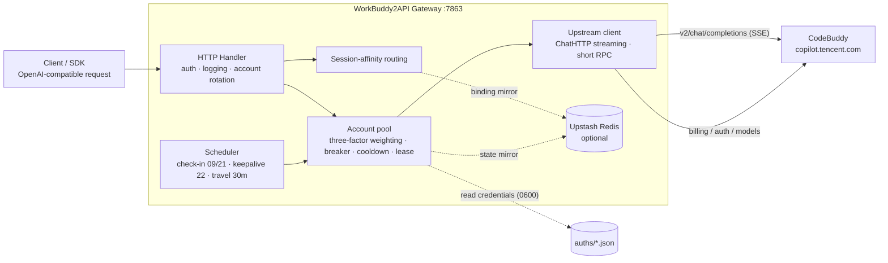

<p align="center">
  
</p>

<h1 align="center">WorkBuddy2API</h1>

<p align="center">
  <b>Turn Tencent CodeBuddy accounts into an OpenAI-compatible multi-account API gateway</b><br>
  OAuth login · Account pool rotation · Circuit breaking & cooldowns · Session affinity · Scheduled check-in keepalive · Streaming / non-streaming
</p>

<p align="center">
  
  
  
  
</p>

<p align="center">
  <a href="./README.md">中文</a> · <b>English</b>
</p>

---

## 📖 Introduction

WorkBuddy2API is a self-hosted **OpenAI-compatible reverse-proxy gateway** that wraps Tencent CodeBuddy accounts (China site `copilot.tencent.com` / international site `www.workbuddy.ai`) into a unified `/v1/chat/completions` service.

- The vendor offers no OpenAI-style public API. This project obtains account credentials via **OAuth device authorization**, handling token auto-refresh, account-pool scheduling, and traffic governance on the gateway side;
- Built for **personal multi-account** scenarios: shared accounts, automatic failover on single-account failure, cooldown/circuit-breaking against cascading failures, session affinity so multi-turn context never hops accounts;
- Clients only ever see an OpenAI-compatible interface — existing SDKs / frontends / tools work with **zero changes**.

> ⚠️ Compliance note: this project is an **unofficial** gateway using CodeBuddy accounts upstream, **for your own authorized accounts and local/private testing only**. See [Security & Compliance](#-security--compliance) for the details.

## ✨ Core Capabilities

| Capability | Description |
|---|---|
| 🔑 **One-shot OAuth login** | `login.sh` device-authorization flow (no PKCE), credentials saved to disk automatically, container restarted |
| 🔄 **Multi-account pool** | Three-factor weighted random account selection (credit share ×10 + idle compensation + success rate ×3), Top-5 candidates + thundering-herd guard |
| 🛡️ **Circuit breaking & cooldowns** | 429/rate-limit-text soft cooldown starting at 600s with exponential backoff (capped by `soft_rate_max`), fixed 60s short cooldown on 404, hard cooldown until 04:00 next day on 402/insufficient balance, consecutive-failure exponential-breaker, in-flight lease limits |
| 🧲 **Session affinity** | Same session (`conversation_id`) stays pinned to the same account when possible, rolling TTL renewal, auto-unbind on failure |
| ⏰ **Scheduled jobs** | Daily 09:00 / 21:00 auto check-in + balance query unfreeze + kitty travel (dispatch/claim); 22:00 token refresh keepalive for all accounts |
| ⚡ **Streaming + non-streaming** | Upstream SSE frames normalized and proxied frame-by-frame; outbound forced `stream:true`, non-streaming aggregated locally into a single response |
| 🧠 **Reasoning-model compatible** | `reasoning_content` allowlist preserved, tool calls (`tool_calls`) merged by index, effort auto-downgrade |
| 📊 **Observability** | One table log line per request (TTFB/token rate/uid); `/healthz` carries a `service` identity for load balancers / host liveness probes |
| 💾 **State persistence** | Local atomic pool-state snapshots + Upstash Redis async mirror (optional), newest-wins restore on restart |
| 🗑️ **Fingerprint scrubbing** | Denylisted fingerprint fields stripped from outbound request bodies (can be disabled) |

## 🗺️ Architecture



## 🚀 Quick Start

### Requirements

- **Docker + Docker Compose** (recommended deployment; the image already contains the low-privilege `app` user)
- One (or more) registered CodeBuddy account(s) for OAuth login
- Host Go ≥ 1.22 (only needed for direct local builds)

### 1. Clone & configure

```bash
git clone https://github.com/Sliverkiss/workbuddy2api.git
cd workbuddy2api
cp config.example.json config.json
```

Edit `config.json` and **at minimum set `api_key`** (`empty = no auth`, always set it for public deployments):

```bash
# Use an editor to change "api_key" to your own strong random string
```

### 2. Log in & add accounts

```bash
./login.sh [cn|global]
# Default cn; use ./login.sh global for global accounts
# 1) The script prints the authorization URL for the matching realm
# 2) Open it in a browser to complete login
# 3) Back in the terminal press y → auto check-in → saved to auths/workbuddy-<uid>.json → container restarted
```

Repeat for more accounts (CN and Global can be mixed — the gateway routes automatically by credential `domain`); the pool auto-discovers new credential files under `auths/` (`SyncToDir` alignment at container startup).

### 3. Start the service

```bash
docker compose up -d --build
```

### 4. Verify

```bash
# Health check (503 when no account is available); the service field confirms you hit this gateway
curl -s http://localhost:7863/healthz
# {"healthy":2,"total":3,"service":"workbuddy2api"}

# Model list
curl -s http://localhost:7863/v1/models \
  -H "Authorization: Bearer your-api-key"

# Account status (summary + per-account detail)
curl -s http://localhost:7863/status \
  -H "Authorization: Bearer your-api-key"

# Streaming chat
curl -sN http://localhost:7863/v1/chat/completions \
  -H "Authorization: Bearer your-api-key" \
  -H "Content-Type: application/json" \
  -d '{"model":"deepseek-v4-flash","messages":[{"role":"user","content":"hi"}],"stream":true}'

# Non-streaming chat (aggregated locally)
curl -s http://localhost:7863/v1/chat/completions \
  -H "Authorization: Bearer your-api-key" \
  -H "Content-Type: application/json" \
  -d '{"model":"deepseek-v4-flash","messages":[{"role":"user","content":"hi"}],"stream":false}'
```

## ⚙️ Configuration

See [`config.example.json`](config.example.json) for the complete sample (meaning of each field below).

```json
{
  "listen": ":7863",
  "api_key": "your-api-key-here",
  "auth_dir": "./auths",
  "state_file": "./data/state.json",
  "cooldown": { "soft_rate": "600s", "soft_rate_max": "2h" },
  "schedule": {
    "checkin_hours": [9, 21],
    "keepalive_hours": [22],
    "checkin_enabled": true,
    "keepalive_enabled": true
  },
  "upstream": {
    "timeout_seconds": 120,
    "header_timeout_seconds": 120,
    "idle_timeout_seconds": 300,
    "chat_base_cn": "https://copilot.tencent.com",
    "billing_base_cn": "https://www.codebuddy.cn",
    "chat_base_global": "https://www.workbuddy.ai",
    "billing_base_global": "https://www.workbuddy.ai"
  },
  "features": { "sanitize_blacklist_fingerprints": true },
  "upstash": { "url": "", "token": "" },
  "pool": {
    "max_in_flight": 3,
    "breaker_threshold": 3,
    "breaker_cooldown": "30m",
    "breaker_cooldown_max": "6h",
    "idle_weight_per_hour": 0.5,
    "idle_weight_max": 5.0
  },
  "session_sticky": { "enabled": true, "ttl": "30m", "gc_interval": "5m" }
}
```

### Field reference

| Field | Default | Description |
|---|---|---|
| `listen` | `:7863` | HTTP listen address |
| `api_key` | empty | Gateway auth key; **empty = no auth, requests pass through** (must be set on public deployments) |
| `auth_dir` | `./auths` | Account credential directory |
| `state_file` | `./data/state.json` | Account-pool state persistence file |
| `cooldown.soft_rate` | `600s` | Soft rate-limit (429/rate-limit text) cooldown **base**; doubles per consecutive hit on the same account |
| `cooldown.soft_rate_max` | `2h` | Cap for soft-cooldown exponential backoff |
| `schedule.checkin_hours` | `[9, 21]` | Daily local-time whole-hour check-in + balance query; runs one kitty-travel pass at the end. **Empty array/`null` = unconfigured, falls back to default** (not disabled) |
| `schedule.keepalive_hours` | `[22]` | Daily local-time whole-hour token-refresh keepalive. Empty array/`null` same as above |
| `schedule.checkin_enabled` | `true` | Check-in **master switch**; `false` really disables check-in (**kitty travel stops too**, see below) |
| `schedule.keepalive_enabled` | `true` | Token keepalive master switch; `false` disables keepalive |
| `upstream.timeout_seconds` | `120` | Total timeout for short RPCs (refresh/check-in/balance/models) |
| `upstream.header_timeout_seconds` | falls back to `timeout_seconds` | Pre-first-byte (response header) limit for chat |
| `upstream.idle_timeout_seconds` | `300` | In-stream idle limit for chat (active output extends the deadline; only silent stalls break the stream) |
| `upstream.chat_base_cn` / `billing_base_cn` | `copilot.tencent.com` / `www.codebuddy.cn` | CN-realm upstream hosts (rarely need changing) |
| `upstream.chat_base_global` / `billing_base_global` | `www.workbuddy.ai` | Global-realm upstream hosts (rarely need changing) |
| `features.sanitize_blacklist_fingerprints` | `true` | Denylisted fingerprint scrubbing for outbound request bodies |
| `upstash.url` / `token` | empty | Empty = pure in-memory mode (Noop fallback, everything still works) |
| `pool.max_in_flight` | `3` | Max in-flight requests per account (`0` = unlimited) |
| `pool.breaker_threshold` | `3` | Consecutive failures before the breaker trips |
| `pool.breaker_cooldown` | `30m` | Base breaker backoff |
| `pool.breaker_cooldown_max` | `6h` | Exponential backoff cap |
| `pool.idle_weight_per_hour` | `0.5` | Idle compensation: +0.5 weight per unused hour |
| `pool.idle_weight_max` | `5.0` | Idle compensation weight cap |
| `session_sticky.enabled` | `true` | Session-affinity routing switch |
| `session_sticky.ttl` | `30m` | Session binding TTL (rolling renewal) |
| `session_sticky.gc_interval` | `5m` | Expired-binding GC interval |

### Upstream timeout semantics (three separate budgets)

| Field | Applies to | Default | Behavior |
|---|---|---|---|
| `timeout_seconds` | Short RPCs (token refresh / check-in / balance / model list) | `120` | Hard total cap; expiry triggers account rotation/breaker |
| `header_timeout_seconds` | Chat SSE **pre-first-byte** | `120` | Enforced by `Transport.ResponseHeaderTimeout`; timeout = rotate and resend |
| `idle_timeout_seconds` | Chat SSE **in-stream idle** | `300` | Active output **extends** the deadline; only silent stalls break the stream and release the lease |

Chat streams (`stream` true/false alike) have **no total time cap**: chat uses a dedicated client with `Timeout=0`, so long reasoning / long outputs (e.g. extra-long reasoning) are never cut off at 120s.

### Environment variable overrides

Load order: JSON file → `WB2A_*` environment variables (non-empty values win):

`WB2A_LISTEN` · `WB2A_API_KEY` · `WB2A_AUTH_DIR` · `WB2A_STATE_FILE` · `WB2A_SOFT_RATE` (duration) · `WB2A_SOFT_RATE_MAX` (duration) · `WB2A_TIMEOUT_SECONDS` · `WB2A_HEADER_TIMEOUT_SECONDS` · `WB2A_IDLE_TIMEOUT_SECONDS` · `WB2A_SANITIZE_FINGERPRINTS` (bool) · `WB2A_CHAT_BASE_CN` · `WB2A_BILLING_BASE_CN` · `WB2A_CHAT_BASE_GLOBAL` · `WB2A_BILLING_BASE_GLOBAL`

### Dual realm (CN / Global)

The gateway routes automatically by each account credential's `domain` and pools can mix both: a `workbuddy.ai` / `codebuddy.ai` suffix → Global (`www.workbuddy.ai`), everything else (including empty) → CN. Chat, refresh, models, balance, check-in, and kitty travel all follow the same routing rule; `Origin`/`Referer` and `X-Domain` switch with the realm. The default hosts work out of the box — you normally never need to set `upstream.*_base_*`.

## 🧠 Account Pool & Traffic Governance

### Account state machine

Each account is described by three orthogonal dimensions:

| Dimension | Fields | Description |
|---|---|---|
| Health | `disabled` / `until` / `breakerUntil` | `healthy = !disabled && !until && !breakerUntil` |
| Concurrency | `inFlight` | In-flight leases (runtime only, not persisted), capped by `max_in_flight` |
| Stats | `successCount` / `errTotal` / `lastUsed` | Feeds success-rate weighting and idle compensation |

```text
  Healthy ──429/404 soft cooldown / 402 hard cooldown / 5xx breaker──▶ cooling/breaker period
     ▲                                                                  │
     │       expiry auto-recovery / check-in balance unfreeze / success reset
     └──────────────────────────────────────────────────────────────────┘

  Disabled (session dead, permanent, requires manual re-login via login.sh)
```

### Error classification & handling

| Class | Trigger | Account handling | Recovery |
|---|---|---|---|
| Insufficient balance | HTTP 402 / body contains balance keywords | Hard cooldown until **04:00 next day** (local time) | Check-in (09:00/21:00) unfreezes on balance recovery |
| Rate limited | HTTP 429 / rate-limit text (any status code) | Soft cooldown `soft_rate` (600s base, doubles per consecutive hit, capped by `soft_rate_max`) | Expiry auto-recovery / reset on success |
| Session dead | body contains `Offline user session not found` / `12153` | **Permanently disabled** | Manual re-login |
| Upstream 404 | HTTP 404 | Fixed 60s soft cooldown (ignores `soft_rate`, no separate backoff) | Expiry auto-recovery |
| Server error | HTTP ≥500 | Feeds consecutive-failure counter, breaker trips at threshold | Breaker expiry / reset on success |
| Client error | Other 4xx / business `code≠0` | No penalty, rotate account and retry | Immediate |

**Breaker**: all cooldown entries (429/404/402) and 5xx share one consecutive-failure counter `fails`; reaching `breaker_threshold` (default 3) trips the breaker with backoff `breaker_cooldown × 2^retryCount`, capped at `6h`; reset on success.

**Soft-cooldown exponential backoff** (a second escalation line alongside the breaker): the soft-limit **cooldown duration itself** backs off — consecutive soft-cooldown hits on one account use `soft_rate × 2^(streak-1)`, capped by `soft_rate_max`. The `soft_streak` counter is independent of the breaker's `fails` and resets only on **success** or **check-in unfreeze**, persisted with `state.json`. Don't confuse the two: soft backoff handles "recently rate-limited" (600s→1200s→2400s…, minutes~hours scale), the breaker handles "pathologically failing" (30m→1h→2h→6h).

### Account selection

1. Filter: disabled / cooling / breaker-tripped / in-flight-full accounts are excluded
2. Take the **Top-5** candidates (by three-factor weight descending — credits are only one factor)
3. Three-factor weighted random pick:
   `weight = credits share ×10 + idleWeight + successRate ×3`
   - `credits share` = this account's credits / max credits in the candidate set
   - `idleWeight` = `min(idle hours × idle_weight_per_hour, idle_weight_max)`, never-used accounts get full score
   - `successRate` = `successCount/(successCount+errTotal)`, no history gets neutral 1.5
4. Thundering-herd guard: skip accounts picked within the last 100ms; when everything is cooling, draft the earliest-expiring account among non-disabled, non-balance-exhausted soft-cooldown/breaker accounts

### Session affinity

Same session reuses the same account when possible, so multi-turn conversations don't hop accounts:

- Session key extraction order: `metadata.conversation_id` → `metadata.user_id` → top-level `conversation_id`
- Rolling TTL renewal (default 30m), GC every 5m; bindings can mirror to Redis (7 days) to survive restarts
- Failed requests auto-unbind; after success the binding follows the finally-successful account

### Scheduled jobs

| Job | Switch | Time (local) | Behavior |
|---|---|---|---|
| Check-in | `schedule.checkin_enabled`, default `true` | `checkin_hours`, default whole hours `[9, 21]` | Check-in + balance query; unfreezes cooled-down accounts on balance recovery; **runs one kitty-travel pass at the end** |
| Keepalive | `schedule.keepalive_enabled`, default `true` | `keepalive_hours`, default whole hour `[22]` | Refresh tokens for all accounts; auto-disables dead sessions |

Container timezone is controlled by `TZ` (compose defaults to `Asia/Shanghai`).

#### Disabling scheduled jobs

Use the explicit `schedule.checkin_enabled` / `schedule.keepalive_enabled` switches, independent of each other:

```json
"schedule": {
  "checkin_hours": [9, 21],
  "keepalive_hours": [22],
  "checkin_enabled": false,
  "keepalive_enabled": true
}
```

Above: **check-in off, 22:00 keepalive still runs**. With both `false` the scheduler has no slots to wait on, so `Run` blocks on the exit signal instead of spinning (no busy-loop CPU burn).

Semantics you must know:

- **Why separate bools instead of an empty hour array for "disabled"**: empty arrays and `null` already mean **"unconfigured → fall back to defaults"** (`[9, 21]` / `[22]`), never "disabled". Keeping that meaning leaves old configs behaving byte-for-byte identically; use `*_enabled: false` to really disable.
- **Disabling check-in also stops kitty travel**: travel has no switch of its own — it rides the check-in slots (see below). To keep travel running, don't disable check-in — instead set `checkin_hours` to the slots you want.
- **Disabling never erases hour config**: `checkin_hours` is kept as-is, flipping back to `true` restores the original slots with no reconfiguration.
- **Hours must be 0-23**: illegal values like `-1` or `25` fail fast at startup with a pointer to the right switch (no silent fallback, so you never think it's off while it still runs at some other whole hour).
- Switches only affect **this process's schedule**, not the pool's cooldown/breaker/disabled state machine; the standalone one-shot tools (`signin.sh` / `cmd/signin`) are separate processes unaffected by these switches.
- **Side effect of disabling check-in**: check-in's balance query "unfreezes on balance recovery" hard-cooled (402 insufficient-balance) accounts; with it off, such accounts only return when the hard cooldown **naturally expires at 04:00 next day** — same-day balance top-ups no longer unfreeze them early.

#### Kitty travel (merged into check-in slots)

Each usable account in the pool advances one travel step per **check-in slot (`checkin_hours`, default 09:00/21:00)** — exactly one action per pass, no polling, no waiting:

**Why no separate schedule anymore**: the daily cap counts "dispatches" at 1/day, rewards lock in at dispatch time and aren't lost if claimed late; travel cycles run in hours, so an extra 30-minute patrol never dispatches twice — just extra upstream requests. Merged into check-in slots, each account makes 2 passes/day: check-in → dispatch → claim in one run. (Check-in runs before travel: unfreezing cooled-down accounts first so this round's travel covers them.)

| Probe result | Action |
|---|---|
| No kitty (`buddy` is `null`) | Agree to the agreement first (idempotent), then try adoption; +300 credits and a kitty once past the gate |
| `state=idle` and not dispatched today | Dispatch to `location_id=4` (Old Town Inn; all 4 locations share the same reward/duration ranges, no optimal choice) |
| `state=arrived` | Claim the arrival reward (with `record_id`) |
| `state=traveling` / daily cap reached / unknown state | Skip |

- **Adoption gate**: when the conversation gate isn't met, upstream returns HTTP 400 `first_buddy task not completed yet` — expected behavior: **one attempt per account per calendar day**, silently skipped afterwards, auto-retried across days (00:00 CST); records are memory-only and reset on process restart.
- **Rate limit**: 800ms between accounts (~40s for 46 accounts) to avoid tripping upstream risk controls.
- **One dispatch per calendar day**: resets on the CST (Asia/Shanghai) calendar day, independent of container `TZ`.
- **Failure isolation**: one account's query/action failure only skips that account's round, never others; no forced refresh on 401 (token refresh belongs to the 22:00 keepalive), failures logged as `travel <uid>: <action>: <error>`.
- **Disabling**: travel has no switch of its own — it runs with check-in, no longer on a separate schedule. So **`schedule.checkin_enabled: false` stops travel as well**; to only change slots (not disable), edit `checkin_hours`.

When check-in and keepalive share an hour (e.g. both include 22:00), both job types run.

## 🔌 API Endpoints

| Endpoint | Auth | Description |
|---|---|---|
| `POST /v1/chat/completions` | Bearer (when `api_key` is non-empty) | OpenAI-compatible completions; streaming/non-streaming; 8 MiB request-body cap |
| `GET /v1/models` | Bearer (when `api_key` is non-empty) | Model list (fetched dynamically, cached 1h; falls back to static table + 5min negative cache on failure) |
| `GET /status` | Bearer (when `api_key` is non-empty) | Account status summary + per-account detail (credits/cooldown/breaker/in-flight/affinity) |
| `GET /healthz` | none | Health check: 200 when a non-full healthy account exists, else 503; carries identity markers (below) |

> Auth rule: `Authorization: Bearer <api_key>` is only verified when `api_key` is non-empty; **with an empty `api_key` the above endpoints pass through directly**; `/healthz` never requires auth.

`/healthz` response example (same shape for 200/503, only status code and counts change):

```json
{"healthy": 2, "total": 3, "service":"workbuddy2api"}
```

The response also carries an `X-Service: workbuddy2api` header. Both identity markers let you tell **this gateway** apart from other services possibly lingering on the same port — those never carry the field/header even on 2xx, so host probes avoid "false success".

### Host health-probe guide

For host programs (e.g. a workbuddy-switch process supervising the gateway child), **"port open + 2xx" is not enough to prove you reached your own gateway**: a stale old-version process or some other service on the same port may return 2xx and fake success. Two approaches, strongest first:

**① Strong check (recommended): `/status` + `api_key`**

```bash
# Expect 200; a 401 means the /status on the other side doesn't know this api_key — not your gateway
curl -s -o /dev/null -w '%{http_code}\n' \
  -H "Authorization: Bearer <api_key>" \
  http://127.0.0.1:7863/status
```

`/status` sits behind the auth middleware: only your own gateway holding the right `api_key` returns 200; old/other services return 401 (or 404). **Prerequisite**: your gateway's `api_key` must be non-empty for this to discriminate; with an empty `api_key`, `/status` passes through and degrades to a weak check.

Host verdicts: `200` → healthy; `401` → not your gateway (port squatted); connection failure → not ready; `5xx` → gateway up but pool unserviceable (can combine with `/healthz` 503 semantics).

**② Weak check (no-credential scenarios): `/healthz` + `service` field**

```bash
# Must verify the service field; status code alone can still fake success
curl -s http://127.0.0.1:7863/healthz | grep -q '"service":"workbuddy2api"'
```

Fits probers that **shouldn't hold the api_key** (load balancers / orchestrators; `/healthz` never requires auth: 200 = can serve, 503 = no servable account in pool). The verdict is response body `service == "workbuddy2api"`; the `X-Service` response header serves header-only probers. A 2xx without the marker → anomaly.

> The container's own `HEALTHCHECK` uses ② (in-process self-check, good enough);
> hosts doing **cross-process ownership confirmation** should use ①.

### Streaming behavior details

- Outbound requests are forced `stream:true`; SSE frames are **rebuilt against an allowlist** per the OpenAI spec (`reasoning_content` kept, tool calls merged by index, unknown fields stripped)
- Exactly one `data: [DONE]` guaranteed (backfill-written when upstream omits it); empty streams first write an `error` frame then `[DONE]`; `error` frames pass through verbatim

## 📋 Per-request logs

One table log line (stdout) per finished `/v1/chat/completions` request:

```text
| #001 | 18:31:31 | deepseek-v4 | stream | 200 | uid=0851ce35 | TTFB=801ms | tok=60 | 23.5tok/s | total=2.6s |
```

| Field | Description |
|---|---|
| `#001` | Process-level request sequence number |
| `18:31:31` | Finish time |
| `deepseek-v4` | Model name (truncated past 11 chars) |
| `stream` / `sync` | Request mode |
| `200` | Status code |
| `uid=0851ce35` | First 8 chars of account UID |
| `TTFB` | First-frame latency for streaming (`-` for non-streaming) |
| `tok` / `tok/s` / `total` | Output tokens / rate / total duration |

**Sensitivity**: logs contain no token plaintext (see [Security & Compliance](#-security--compliance)), no log files on disk.

## 🛡️ Security & Compliance

### 1. Credential management (auths)

- **Location**: `./auths` (configurable via `auth_dir`), files named `workbuddy-<uid>.json`
- **Contents**: plaintext `accessToken` / `refreshToken` + account metadata, shaped as:

```json
{
  "account": { "uid": "…", "enterpriseId": "…", "nickname": "…" },
  "auth": { "accessToken": "plaintext", "refreshToken": "plaintext", "expiresAt": 0, "domain": "" }
}
```

- **Permissions**: the container runs as the `app` user (uid 10001); token refresh writes back atomically via `SaveAtomic` with `0600` (tmp + rename); first-time saves by `login.sh` follow the login umask — manually `chmod 600 auths/*.json` is recommended
- **Backup**: back up `auths/` (credentials) and `data/state.json` (pool state: credits/cooldowns/counters); with Upstash configured, state is additionally mirrored to Redis
- **Never commit to git**: `.gitignore` already excludes `auths/`, `data/`, `backups/`, `config.json`, `*.key`, `*.pem`

### 2. Network exposure & log sensitivity

- Default listen `:7863`, compose exposes `0.0.0.0:7863`, **no built-in TLS**; always set `api_key` on public deployments, preferably behind a reverse proxy / private network
- Request log fields: sequence/model/mode/status code/**uid first 8 chars**/TTFB/token counts — **no** `accessToken`/`refreshToken`/`api_key` plaintext (the `Authorization` header is never read)
- Logs go to **stdout/stderr** (visible via `docker logs` inside containers); the code never writes log files to disk

### 3. Upstream endpoint inventory

| Endpoint | Method | Host | Purpose |
|---|---|---|---|
| `/v2/chat/completions` | POST | `copilot.tencent.com` | Chat completions (SSE) |
| `/console/enterprises/personal/models` | GET | same | Dynamic model list |
| `/v2/plugin/auth/token/refresh` | POST | same | Token refresh |
| `/v2/billing/meter/daily-checkin` | POST | `www.codebuddy.cn` | Daily check-in |
| `/v2/billing/meter/get-user-resource` | POST | same | Balance query |
| `/v2/plugin/auth/state?platform=CLI` | POST | `copilot.tencent.com` | OAuth: fetch authorization URL |
| `/v2/plugin/auth/token?state=` | GET | same | OAuth: poll for token |
| `/v2/plugin/login/account?state=` | GET | same | OAuth: fetch account info |
| `/activity/growth/buddy/agreement` `first` `info` | POST/GET | same | Kitty travel: agree / first adoption / query |
| `/activity/growth/buddy/travel/status` `depart` `claim` | GET/POST | same | Kitty travel: status / dispatch / claim (runs at check-in slots) |

> The `/v2/*` endpoints above are the interfaces used by CodeBuddy's official CLI/plugins — **no public API docs exist; they are unofficial/reverse-engineered**; this project claims no official authorization or stability promise for any upstream interface. Outbound traffic carries a uniform `CLI/2.63.2 CodeBuddy/2.63.2` UA; chat requests carry account headers (`X-User-Id` etc.) and **never carry `X-Refresh-Token`**.
>
> Dual-realm hosts: CN uses `copilot.tencent.com` (chat/auth/models/travel) + `www.codebuddy.cn` (billing); Global (international) uses `www.workbuddy.ai` for both, with the same paths as the table above.

### 4. Release provenance & compliance scope

- **No prebuilt releases**: the repo has no Releases / tags; the artifact = source you build yourself
- Build command: `CGO_ENABLED=0 go build -trimpath -ldflags="-s -w" -o wb2api ./cmd/server` (Dockerfile multi-stage: `golang:1.23-alpine` build → `alpine:3.20` runtime)
- Login/check-in/credit tools: `./login.sh` / `./signin.sh` / `./credit.sh` (auto-compiles the matching `cmd/*` when missing)
- **No artifact checksums**: `go.sum` only constrains Go module dependencies; the Docker image is built locally via `docker compose build` with no third-party images referenced
- Upstream CodeBuddy is a Tencent commercial product; this project is its **unofficial OpenAI-compatible gateway**; using its accounts as an API gateway may implicate the target platform's ToS and account risks — the author is not responsible for account bans, ToS violations, or usage outcomes

### 5. Authorized-use boundaries

- Only for **your own authorized accounts**, local/private testing
- No sharing, reselling, illicit redistribution, or uses violating the target platform's terms
- Abide by the CodeBuddy platform ToS and your local laws
- Safeguard `auths/` (plaintext credentials) and the gateway port

## 🧰 Tool scripts

| Script | Purpose |
|---|---|
| `./login.sh [cn\|global]` | OAuth login → save auth → restart container (default `cn`) |
| `./signin.sh [auths_dir]` | Batch check-in (refreshes first when expired) |
| `./credit.sh` / `./credit.sh -json` | Credit daily report (pretty / raw JSON) |

## 🛠️ Development

### Local build & test

```bash
go build ./...
go vet ./...
go test ./... -count=20   # run repeatedly to prove no flakes
go test -race ./... -count=1
gofmt -l .
```

### Directory layout

```
cmd/
  server/    # main service (config + main + route wiring)
  login/     # OAuth login tool
  credit/    # credit query tool
  signin/    # batch check-in tool
internal/
  auth/      # credential parsing + token refresh + atomic write-back
  pool/      # account pool (state machine/breaker/lease/weighting/persistence)
  scheduler/ # scheduled check-in + keepalive + kitty-travel patrol
  server/    # HTTP handlers + auth + request logging
  session/   # session-affinity routing
  upstream/  # upstream wrappers (chat/billing/auth/headers/sse/payload/sanitize/idle)
  redisstore/# Upstash persistence + Noop fallback
```

## Disclaimer

This project is for learning and research only. Users must comply with the CodeBuddy Terms of Service and bear their own usage risks (including account bans, ToS violations, etc.). The author is not liable for any direct or indirect loss from using this project.

## License

This project is open-sourced under the [MIT License](LICENSE).

- Free to use, copy, modify, merge, publish, distribute, re-license, and sell
- On redistribution (source or binary, including bundled builds in combined works), please keep the original MIT copyright and license notices (a credit to `https://github.com/Sliverkiss/workbuddy2api` in NOTICE or README is greatly appreciated)
- This project grants no rights to any upstream (CodeBuddy / Tencent) interfaces or services; users must still comply with the upstream ToS (see disclaimer above)
